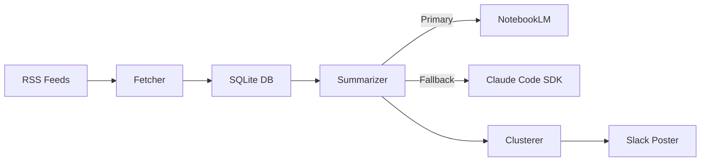

# yt-digest

Daily YouTube channel monitor that summarizes new videos and posts a clustered digest to Slack.

## How it works

1. Fetches RSS feeds from monitored YouTube channels
2. Summarizes new videos using NotebookLM (falls back to Claude Code SDK)
3. Clusters summaries by topic using Claude
4. Posts a grouped digest to Slack

## Architecture



## Setup

```bash
# Clone
git clone https://github.com/yorrick/yt-digest.git
cd yt-digest

# Install
uv sync --all-extras

# Configure
cp .env.example .env
# Edit .env with your Slack webhook URL

# Initialize database and seed channels
uv run python -m yt_digest --init

# Test run (prints to stdout)
uv run python -m yt_digest --dry-run

# Production run
uv run python -m yt_digest
```

## CLI Options

| Option | Description |
|--------|-------------|
| `--init` | Initialize DB and seed channels from YouTube handles |
| `--dry-run` | Print digest to stdout instead of posting to Slack |
| `--config PATH` | Path to config file (default: `config.yaml`) |

## Ubuntu Desktop Deployment

### Install

```bash
mkdir -p ~/work && cd ~/work
git clone git@github.com:yorrick/yt-digest.git
cd yt-digest
uv sync --all-extras
```

### Configure

```bash
# Create .env with your Slack webhook URL
cp .env.example .env
# Edit .env

# (Optional) Set up NotebookLM as primary summarizer
uv run notebooklm login
# Auth token is stored in ~/.notebooklm/storage_state.json

# Initialize database and seed channels
uv run python -m yt_digest --init
```

### Systemd Timer (daily at 8am)

Create the service unit:

```ini
# ~/.config/systemd/user/yt-digest.service
[Unit]
Description=Fetch new YouTube videos, summarize, and post digest to Slack
After=network-online.target
Wants=network-online.target

[Service]
Type=oneshot
WorkingDirectory=/home/youruser/work/yt-digest
ExecStartPre=/usr/bin/git pull
ExecStart=/home/youruser/.local/bin/uv run python -m yt_digest
TimeoutStartSec=900

[Install]
WantedBy=default.target
```

Create the timer unit:

```ini
# ~/.config/systemd/user/yt-digest.timer
[Unit]
Description=Run yt-digest daily at 8am

[Timer]
OnCalendar=*-*-* 08:00:00
RandomizedDelaySec=5min
Persistent=true

[Install]
WantedBy=timers.target
```

Enable and start:

```bash
systemctl --user daemon-reload
systemctl --user enable --now yt-digest.timer

# Verify
systemctl --user list-timers yt-digest.timer

# Manual test run
systemctl --user start yt-digest.service

# Check logs
journalctl --user -u yt-digest.service
```

The service runs `git pull` before each execution, so pushing changes to the repo automatically deploys them.

## Requirements

- Python 3.10+
- Claude Code CLI (for Max subscription auth)
- Slack Incoming Webhook
- NotebookLM account (optional, for primary summarizer)

## Configuration

Edit `config.yaml` to customize:
- Summarizer selection (primary/fallback)
- Claude model
- Database path

Secrets go in `.env` (gitignored).

## Testing

```bash
uv sync --all-extras
uv run pytest -v
```
