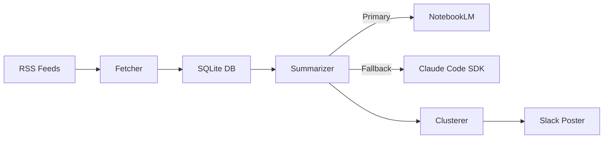

# yt-digest

Daily YouTube channel monitor that summarizes new videos and posts a clustered digest to Slack.

## How it works

1. Fetches RSS feeds from monitored YouTube channels
2. Summarizes new videos using NotebookLM (falls back to Claude Code SDK)
3. Clusters summaries by topic using Claude
4. Posts a grouped digest to Slack

## Architecture



## Setup

```bash
# Clone
git clone https://github.com/yorrick/yt-digest.git
cd yt-digest

# Install
pip install -e ".[dev]"

# Configure
cp .env.example .env
# Edit .env with your Slack webhook URL

# Initialize database and seed channels
python -m yt_digest --init

# Test run (prints to stdout)
python -m yt_digest --dry-run

# Production run
python -m yt_digest
```

## CLI Options

| Option | Description |
|--------|-------------|
| `--init` | Initialize DB and seed channels from YouTube handles |
| `--dry-run` | Print digest to stdout instead of posting to Slack |
| `--config PATH` | Path to config file (default: `config.yaml`) |

## Cron setup

```bash
crontab -e
# Add:
0 8 * * * cd /path/to/yt-digest && /path/to/python -m yt_digest
```

## Requirements

- Python 3.10+
- Claude Code CLI (for Max subscription auth)
- Slack Incoming Webhook
- NotebookLM account (optional, for primary summarizer)

## Configuration

Edit `config.yaml` to customize:
- Summarizer selection (primary/fallback)
- Claude model
- Database path

Secrets go in `.env` (gitignored).

## Testing

```bash
pip install -e ".[dev]"
pytest -v
```
